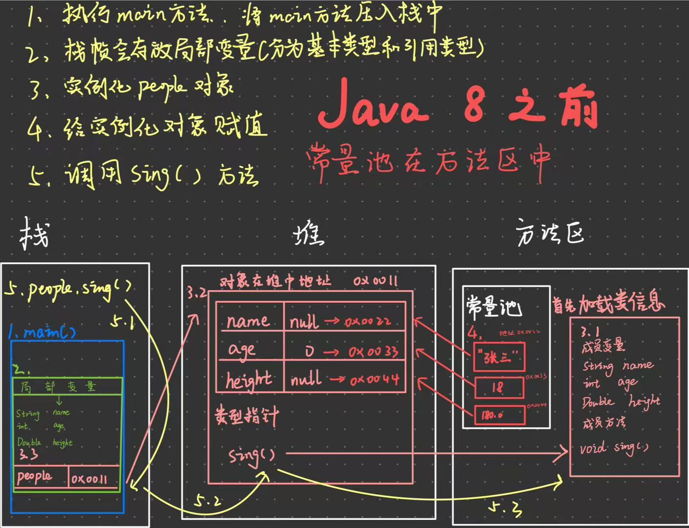
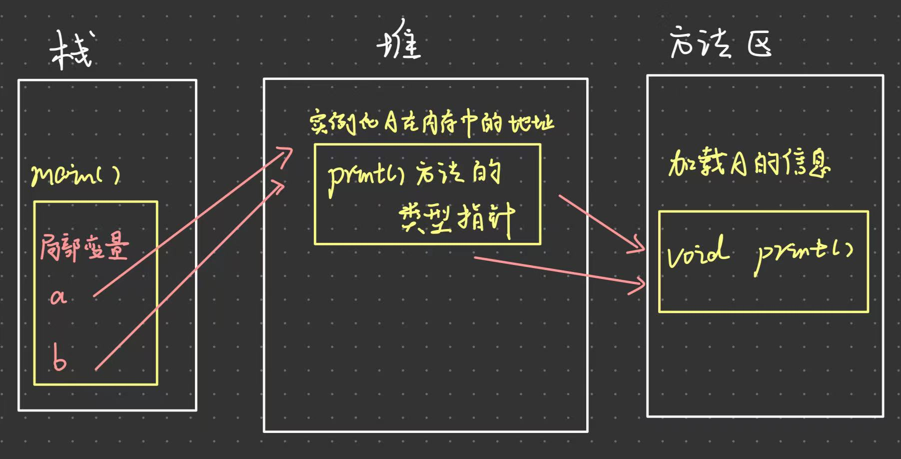
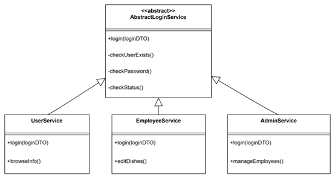

# 持续学习是重中之重--坚持

## 一、Java基础概念

### Java定义

Java面对分布式复杂应用

JDK  (Java development Kit) Java开发者工具

JRE (Java runtime environment) Java运行时环境

JVM (Java virtual machine) 安装Java虚拟机实现Java可移植性


Java SE (Java standard edition) Java 标准版

Java EE (Java Enterprise edition) Java 企业版

### Java安装

- [Java官网下载jdk](https://www.oracle.com/cn/java/technologies/downloads/)
- 配置环境变量

**JRE 已经被整合到 JDK 中**

从 **JDK 9** 开始，Java 引入了模块化系统（JPMS，即 Project Jigsaw）。这个变革让运行时组件（包括 JRE）被模块化，开发者可以根据需求定制运行时环境，而不需要依赖一个固定的 JRE。

遇到的问题：

path中存在其他路径的JDK，因此无法正常读取Java版本

### Java运行原理

**编译：**Java 源代码（.java 文件）被 Java 编译器（javac）编译成字节码（.class 文件）。字节码是一种中间表示形式，不依赖于特定的硬件或操作系统。
**解释与执行：**字节码在 Java 虚拟机（JVM）上运行。JVM 是一个解释器和 JIT（即时编译器）组合体，它将字节码转换为机器码并执行。解释器逐行读取和执行字节码，而 JIT 编译器则将热点代码（经常执行的代码）编译为机器码，以提高性能。

### 命名规范

类名：首字母大写+驼峰命名法

方法名，变量名等：首字母小写+驼峰命名法 

常量名：大写+下划线

language level：与java的版本相关，一般向后兼容

注释： // or /* */

包名：一般利用公司域名倒置作为包名

### JavaDoc

javadoc是从程序源代码中抽取类、方法、成员等注释形成一个和源代码配套的API帮助文档

```java
/**string方法
     *
     * @param name 输入的名称
     * @return 放回处理后的字符串
     * @throws Exception 发生错误时抛出异常
     * @author midking
     */
//需要对注释里的每个@后面的参数进行解释
public String test(String name) throws Exception{
    return name;
}
```

### Scanner输入

```java
Scanner scanner = new Scanner(System.in); //new一个scanner对象 
while((scanner.hasNextDouble())) { //判断下一个值是否是double类型的
    double i = scanner.nextDouble(); //接受下一个double类型的值
scanner.close(); //关闭节约内存、
    
scanner.hasNext()//函数在输入之后，会截取空格之前的值 但是
//如果是以空格分隔的多个字符 例如hello world cc！
while(scanner.hasNext())
    String i = scanner.next() //输出 hello（回车）world（回车）cc！
if(scanner.hasNext())
    String i = scanner.next() //输出 hello
//scanner.hasNext()原理是扫描缓冲区中是否有字符，有则返回true， world cc！是存在于缓冲区中，循环则可以全部读出。扫描为空之后，循环这时并不返回false，而是将方法阻塞，等待输入内容然后继续扫描
    
scanner.hasNextLine()//nextLine只会以回车判别整个字符串的输入，
```

## 二、基本语法

### 基本类型

|  类型   | 大小(字节or位) |   封装    |
| :-----: | :------------: | :-------: |
|  byte   |       1B       |   Byte    |
|   int   |       4B       |   Short   |
|  short  |       2B       |  Integer  |
|  long   |       4B       |   Long    |
|  float  |       4B       |   Float   |
| double  |       8B       |  Double   |
|  char   |       2B       | Character |
| boolean |       1b       |  Boolean  |

long类型要在变量值后面加上**L**

float类型要在变量值后面加上**F**

### 进制

默认十进制

加0b二进制

加0八进制

加0x十六进制

```java
int demo01 = 0b10;
int demo02 = 10;
int demo03 = 010;
int demo04 = 0x10;
//打印出来的分别是 2 / 10 / 8 / 16
```

### 浮点数误区

```java
float f1 = 0.1f;
double f2 = 1.0/10;
System.out.println(f1 == f2);
//打印出来的是false ，避免直接使用==比较两个浮点数
```

浮点数在计算过程中可能会引入微小的精度误差，即使两个浮点数在数学上应该是相等的，存储在计算机中也可能会有所不同

### 类型转换

char, byte, short > int > long > float > double

低到高要加**强制**转换	高到低**自动**转换

int不会入只会舍

```java
//类变量 关键字 static
static int salary = 2000;
//实例变量，没有定义值的话基本类型默认值为0， 其他类型为null(封装也为null)
String name;
Integer age;
public static void main(String[] args) {
    //局部变量
    int i = 10;
    Variable variable = new Variable();
    
//类常量 关键字 final
static final double PI = 3.14;
```

### 字符串连接符

```java
int a = 10;
int b = 20;
""+a+b; //输出1020
a+b+""; //输出30
```

### 字符串转基本类型

```java
private static boolean isNumeric(String str){
    try {
        Double.parseDouble(str);
        return true;
    }catch (NumberFormatException  e){
        return false;
    }
}
/*
Double.parseDouble(str)自动忽略字符串中的空格、制表符和换行符，类似的还有
Integer.parseInt()
一般要用try，catch防止转换中的错误
*/
```

### 流程控制关键字（switch，for）及循环例题

#### Switch

```java
String result = switch (sc.nextLine()) {
    case "jungleKing" -> "jungleKing";
    case "midKing" -> "midKing";
    default -> "1";
};
//在java12之后，使用switch增强式精简代码
```

有个问题：java -> class(字节码) 再通过反编译(idea)，没有用到hashCode

#### For

```java
int[] array = {10, 20, 30}
for(int num: array){
    System.out.println(num);
}
//增强 for 循环,直接打印
//三目运算符 解决格式问题
System.out.print(j + " * " + i + " = " + i*j + (j==i ? '\n' :"\t"));
```

#### 打印三角形/杨辉三角

```java
" ".repeat(n) //java11之后将字符串快速重复
int[][] array = new int[row][];//创建二维数组 
```

### Return

在java中return的是地址

```java
return array;
//从方法中返回的数组是地址
int[][] result = YHTriangle(5);
for (int i = 0; i < result.length; i++) {
    System.out.println(result[i]);
//输出结果为地址
[I@15db9742
[I@6d06d69c
[I@7852e922
[I@4e25154f
[I@70dea4e
//正确方法要将Array.toString 
//Array.toString是将一维数组转为字符串，在二维数组中将内层的每个数组转为字符串输出
 for (int[] ints : array) {
     System.out.println(Arrays.toString(ints));
 }
 System.out.println(Arrays.deepToString(result));
```

**方法重载**

方法名必须相同，方法的参数（类型/个数/顺序不同）

## 三、数组

### 数组动态初始化

```java
int[] array = new int[10];
/*
JVM会在启动时创建堆，堆占用物理内存的一部分
java数组在动态初始化时，会在堆中申请一部分连续内存，将数组在堆中的首地址赋值给栈中的变量，栈就可以找到堆空间里面的数组
*/
```

### 初步了解Arrays.sort底层(待完善)

| **排序方法**              | **使用条件**                                 | **数组规模**                              | **性能**              |
| ------------------------- | -------------------------------------------- | ----------------------------------------- | --------------------- |
| 插入排序 (Insertion Sort) | 小数组或小部分数组，规模 < 44 或 < 65        | 小于 44 或小部分数组（< 65）              | O(n2)（小规模更高效） |
| 合并排序 (Merge Runs)     | 数组接近部分排序，规模 > 4096                | 大于 4096                                 | O(nlog⁡n)              |
| 堆排序 (Heap Sort)        | 快速排序递归深度过深                         | 无特定限制                                | O(nlog⁡n)              |
| 双轴快速排序 (Dual-Pivot) | 默认排序，适用于大多数数据                   | 中等到大规模数组（> 44）                  | O(nlog⁡n)              |
| 计数排序 (Counting Sort)  | 数据类型为 `byte` 或 `short`，且规模满足条件 | 字节数组 >= 64 或 短整型/字符数组 >= 1750 | O(n)                  |
| 并行排序 (Parallel Sort)  | 数组规模大，支持多线程处理                   | 大于等于 4096                             | O(nlog⁡n)              |

### 稀疏数组

稀疏数组是指在一个数组中，大部分元素为默认值或无效值，只有少数元素含有有效数据。

数组因为需要固定先计算出有效值的个数，相较于列表来说较繁琐

## 四、面向对象基础

### 面向对象

面向对象oop(Object-Oriented-Programming)

面向对象编程的本质是：**以类的方式组织代码，以对象的防止组织(封装)数据。**

|              | 区别                                                         |
| ------------ | ------------------------------------------------------------ |
| **面向过程** | 具体的，落实到解决是一个具体实际问题上<br />例如解决一个杨辉三角的问题<br />1、获取要打印的行数<br />2、循环每次创建一个新数组并在两头赋值为1<br />3、对数组中间的值填充读取上一个数组同索引和同索引-1的两个数的和 |
| **面向对象** | 宏观的，关注的是如何通过对象的设计和交互解决一类问题，而不是具体实现的步骤。<br />面向对象的核心理念包括：<br />1. **封装：** 将数据和操作数据的方法绑定在一起，通过类和对象隐藏内部实现，只对外暴露必要的接口。<br />2. **继承：** 通过子类继承父类的属性和方法，避免重复代码，实现代码复用和拓展性。<br />3. **多态：** 不同的对象在调用同一个方法时可以表现出不同的行为，从而提升程序的灵活性和可扩展性。<br />例如杨辉三角问题：<br />1. 创建一个 `Triangle` 类，其中包含生成和打印杨辉三角的方法。<br />2. 实例化 `Triangle` 对象，并通过调用它的方法解决问题，**而无需关心具体的实现细节**。 |

### 类和对象

```java
/*
类是抽象的，实例化
类是一个模板，类中之后属性和方法
new Student()对Student类进行实例化，实例化返回一个Student的对象(canyon就是对象)
canyon对象是一个Student类的一个具体实例
*/
public class Student {
    public void study(){
        System.out.println(".....");
    }
}
Student canyon = new Student();
canyon.study();
//当方法定义为public，student类被实例化后可以调用study方法，但是
private void study()//不行，'study()' has private access in 'cn.edu.ncu.classDemo.Student'
问题2：
setter() getter()方法
    封装
```

#### 为什么要将实体类设置为private并且使用setter和getter封装？

从规范角度来看，对一个数据的权限读和写要分开来，`setter/getter`正好区分了不同的功能，如果设置为`public`然后直接读和写看起来不够清晰

从方便性来看，如果需要对年龄或者其他属性修改前进行校验，`setter`可以在修改前进行校验，`public`则需要写多次校验，`getter`则是在需要的情况下在数据返回前端前加上统一的格式

可以实现只读、只写属性，使用 `getter` 而不提供 `setter`，让字段变成**只读属性**，而`public`无法控制

```java
public class Student {
    public Integer age;
}
Student student = new Student();
int a = student.age;
student.age = 18;

//@Data注解省去setter和getter
@Data
public class Student{
    private Integer age;
}
Student student = new Student();
int a = student.getAge();
student.setAge(18);
```

### 构造方法

构造方法一定与类名相同，并且无返回值，不能使用void

```java
public class People {
    //在创建一个类时，会有隐式的构造方法，因此空类也可以实例化对象
    public People(){//隐式的构造方法，在Java编译之后的class文件中可以看到
    }
    //显示定义构造器
    String name;
    public People(){
        this.name = "canyon";
    }
    public People(String name){
        this.name = name;
    }
}
public static void main(String[] args) {
    People people = new People();
    System.out.println(people.name);//输出canyon
    People people1 = new People("kimBoo");
    System.out.println(people1.name);//输出kimBoo
}
/*
如果要调用无参构造时，存在有参构造方法的情况下需要显示定义无参构造方法
alt+insert constructor 根据属性快速写出有参构造方法和无参构造方法
*/
```

### static关键字

```java
public static void a(){
    b(); //不可调用
}
public  void b(){

}
//非静态方法实例化 new
//目前理解是静态方法a()会随着类一起加载，因此不需要实例化，但是非静态方法b()需要类实例化才能调用
```

static成员属性和成员方法在类加载后被内存中的所有**线程**共享，在多个类使用和操作时使用

因此静态变量或方法直接用类名操作，无需通过某个对象操作

```java
public class Teacher {
    private String name;
    private static int age;

    public static void main(String[] args) {
        Teacher te = new Teacher();
        System.out.println(te.name);
        System.out.println(Teacher.age);
        System.out.println(age);//因为在当前类中可以实现
    }
}
//static关键字修饰的成员属性和成员方法一般直接用类名.变量或者方法调用（Teacher.age）
```

静态代码块随着类加载，并且只加载一次

```java
public class demo {
    static {
        System.out.println("静态代码块");
    }
    {
        System.out.println("匿名代码块");
    }
    public demo() {
        System.out.println("构造方法");
    }

    public static void main(String[] args) {
        demo demo = new demo();
        System.out.println("=".repeat(50));
        demo demo2 = new demo();
    }
}

//加载顺序
/*
静态代码块
匿名代码块
构造方法
==================================================
匿名代码块
构造方法
*/
```

## 五、对象内存分配

### JVM中栈，堆，方法区

#### 栈

Java 虚拟机栈（Java Virtual Machine Stacks）是线程私有的，生命周期随着线程，线程启动而产生，线程结束而消亡。当线程启动时会创建虚拟机栈，每个方法在执行时会在虚拟机栈中创建一个栈帧，用于存储局部变量表、操作数栈、动态连接、方法返回地址、附加信息等信息。

栈内存的大小可以有两种设置，固定值和根据线程需要动态增长。

#### 堆

JVM会在启动时创建堆，堆占用物理内存的一部分，堆存储的全部都是对象，每个对象包含了一个与之对应的 class 类的信息。
jvm 只有一个堆区(steap)，它会被所有线程共享，堆中不存放基本数据类型和对象引用，它只存放对象本身。

#### 方法区

又被称为静态区，它跟堆一样，被所有的线程共享，方法区包含所有的 class 信息 和 static修饰的变量。
方法区中包含的都是整个程序中永远唯一的元素，如：class、static变量。

### 实例化对象时的内存变化(待完善)

#### 代码实现

```java
public class People{
    String name; // 定义一个成员变量 name
    int age; // 成员变量 age
    Double height; // 成员变量 height
    
    void sing(){
        System.out.println("人的姓名："+name);
        System.out.println("人的年龄："+age);
        System.out.println("人的身高："+height);
}

    public static void main(String[] args) { 
        String name; 
        int age; 
        Double height; 
	
        People people = new People() ; 
        people.name = "张三" ; 
        people.age = 18; 
        people.height = 180.0 ; 
        people.sing(); 
	}
}
```

#### 实现流程

1. main方法创建栈帧压入栈中
2. 创建局部变量，栈帧中存放局部变量，基本类型的变量的值存在栈帧中，引用类型(包括对象)实例化时，会将地址存放在栈帧中，堆中开辟空间存放实例
3. 实例化people对象，先将类信息的成员变量和成员方法放入方法区中，之后在堆中开辟空间存放成员变量并根据类型赋予默认值，并且存放成员方法的类型指针，最后将堆中地址放入栈帧的对象所对应的值中。
4. 给实例化对象赋值，对于引用类型常量（如 `"张三"`），会先在方法区的运行时常量池中查找是否已有值，若无则创建；对于数值类型（如 `18` ），直接赋值到堆内存中对象对应的实例变量。
5. 调用sing() 方法，先到栈区找到 people这个引用变量，然后根据该地址值在堆内存中找到对象的类型指针，最后方法区方法实现。在方法体void sing()被调用完成后，就会立刻出栈
6. main()方法出栈



#### 引用变量问题

Student junking = canyon;会将canyon在栈中的引用变量(地址)给到junking，修改junking的age就是修改堆中地址的age值，canyon由于指向堆中地址不变，所以canyon的age也会发生变化

```java
        Student canyon = new Student();
        canyon.age = 21;
        canyon.study();
        System.out.println(canyon.age);//输出21
        Student junking = canyon;
        junking.age = 31;
        System.out.println(canyon.age);//输出31
```

#### 后续完善

这是java8之前的jvm版本，其中常量池是在方法区中，java8之后常量池移动到堆中，并且jvm进行了较大的改动，这是之后补充的方

### 基础和引用类型默认初始化

数字：0 0.0

char：u0000

boolean：false

引用：null

## 六、面向对象

### 封装

**数据隐藏**：封装通过私有属性保护对象的内部状态，防止外部直接访问。

**安全性和合理性检查**：通过公共方法（getter和setter）访问和修改私有属性，可以实现数据的安全性和合理性检查。

**易于维护**：封装使得对象的内部实现可以独立于外部使用者进行修改，增强了代码的可维护性。

```java
//public的属性
class Student(){
    int age;
    String name;
}
	Student s1 = new Student();
	s1.age = -1;//不方便做校验

//private的属性 可以实现数据的安全性和合理性检查
class Student(){
    private Integer age;
    private String name;
    public String getName() {
        return name;
    }
    public void setName(String name) {
        this.name = name;
    }
    public int getAge() {
        return age;
    }
    public void setAge(int age) {
        if (age < 120 && age >0){
        	this.age = age;
        }else{
            System.out.println("年龄不合法！");
        }
    }
}
	Student s2 = new Student();
	s2.setAge(-1);//输出年龄不合法
```

### 继承

```java
public class Application {
    public static void main(String[] args) {
        Student student = new Student();
        student.say();
        System.out.println(student.name);
    }
}
/*
Student类可以继承Person类中的public成员方法和成员变量
所有类都直接或间接继承自Object类
ctrl+H查看类的继承树状图
main方法放在application类中
*/
```

### super和this关键字

```java
//Person类的定义
protected String name = "canyon";
//Application类的set方法
student.setName("junking");
//Student类的定义
public class Student extends Person{
    private String name;

    public String getName() {
        return name;
    }

    public void setName(String name) {
        this.name = name;
    }
    public void print(){
        System.out.println(this.name);
    }
    public void test(){
        super.print();
        System.out.println("super.name:"+super.name);//输出cnayon
        System.out.println("this.name:"+this.name);//输出junking
    }
}
//使用this区分成员变量和局部变量
//super 是一个指向父类对象的引用，主要用于访问父类的成员变量、方法和构造方法。
```

```java
public Person() {
    System.out.println("Person执行");//先执行
    }    
public Student() {
    //默认继承父类的构造方法，且super()必须在前
    super();
    System.out.println("Student执行");//后执行
    }
//父类改为有参构造，必须显式写出无参构造，不然子类没办法继承
```

### 重写

父类的方法必须是public才可以重写

需要有继承关系，子类重写父类的方法

#### 静态方法

静态方法不需要实例化对象，随着类的加载一起加载，可以直接使用

```java
public class A extends B{
    public static void print(){
        System.out.println("A->");
    }
}
public class B {
    public static void print(){
        System.out.println("B->");
    }
}
        A.print();//输出A->
        B.print();//输出B->
```

#### 非静态方法

在A继承B的情况下，相同的方法名和参数即使不加@override注解，A的方法就是对B的方法进行重写

@override注解好处是

**增强代码可读性**：

- 表明该方法是对父类方法的重写，帮助开发者快速理解代码。

**避免书写错误**：

- 如果方法签名拼写错误（例如参数列表不匹配），而没有加 `@Override`，编译器不会报错，而是认为你定义了一个子类的全新方法。
- 加了 `@Override` 后，如果方法签名不匹配，编译器会直接报错，提醒你修正错误。

```java
public class B {
    public void print(){
        System.out.println("B->");
    }
}
public class A extends B{
    @Override
    public void print() {
        System.out.println("A->");
    }
}
        A a = new A();
        a.print();//输出A->
		//父类的引用指向了子类
        B b = new A();
        b.print();//输出A->
//a.print()：a 是 A 类型的引用，直接调用 A 的 print() 方法，输出 A->。
//b.print()：虽然 b 是 B 类型的引用，但实际引用的对象是 A 类型，因此调用的是 A 重写的 print() 方法，输出 A->。
```




### 多态

基于上面重写，多态就是父类的引用指向了子类，通过父类引用，可以实现对多个子类的统一操作

子类新增了自己的方法，父类引用无法直接访问

子类可以调用自己的方法和继承父类中的方法=====父类可以调用自身的方法和子类重写的方法

```java
        A a = new A();
        a.print();
        B b = new A();
        b.print();
        a.run();//子类中新增方法
        ((A) b).run();//强制转换为子类调用方法
//在idea中，强制转换这一步A出现了警告告知编译器已经知道 b 的实际类型是 A，但在实际应用中，强制转换在父类不知道子类的引用类型时是有必要的
```

#### instanceof关键字

`instanceof`可以判断某个对象是否属于某个类，也可以判断该对象是不是某个类的子类

```java
//Student继承Person
Person person = new Student();
if(person instanceof Student){
    //返回真
    return true;
}
if(person instanceof Person){
    //返回真
    return true;
}
```

### 抽象类

```java
public abstract class Action {
    public abstract void doSomething();
}
```

抽象类更多地被看作一种约束，先声明方法等待子类继承重写

抽象类中有构造方法(没有构造方法子类没办法继承，**隐式的会有一步super.Action()**)，可以有成员方法，但是抽象类无法被实例化，因此自身的成员方法也只能被继承在使用

### 接口(面向接口编程)

一个基础项目的逻辑，controller层提供数据交互的api，并调用service层的接口，在service层的方法上写注释（大部分时候就是定义到接口这一部分，之后就是具体方法的实现）

**难点：**不能局限于面向接口编程，需要想好整个项目的架构，定义好前后端数据交互的格式和内容，什么地方调用什么接口的方法，最后再写接口的具体实现方法


### `equals`方法和`==`的区别

#### 基本数据类型

基本数据类型不含`equals`方法，基本数据类型在**栈中**直接保存值，比较值是否相等

**除此之外，`==`比较的都是栈中地址**

```java
int a = 5;int b = 5;
System.out.println(a == b); // true
```

#### 包装类（==比较地址）

对于`int`的包装类`Integer`， Java 会缓存 **`-128` 到 `127`** 范围内的 `Integer` 对象，因此使用`==`时x和y指向的是堆内对象，返回`true`，但是超出范围等于新建对象，因此x和y指向的堆内对象都不相同，返回`false`

```java
//JDK8
Integer x = 127;
Integer y = 127;
System.out.println(x == y); // true (值在缓存范围内)


Integer x = 128;//等价于        Integer integer = Integer,valueOf(128); 
Integer y = 128;
System.out.println(x == y); // false (超出范围，改为新建对象)
```

**注意：**`JDK21`以及将上限(原`JDK8`中的128)改为可通过`JVM `参数配置上限

​			不推荐`	 Integer integer = new Integer(128);	`的写法，已被弃用

#### 引用数据类型

**未重写的`equals`方法（`Object`类）** 

```java
if (this == anObject) return true;
```

二者比较的是地址

```java
Object obj1 = new Object();
Object obj2 = new Object();
System.out.println(obj1 == obj2); // false
System.out.println(obj1.equals(obj2)); // false
```

**重写的`equals`方法（`String`类）**

`String`类重写的`equals`方法，首先判断引用是否一样，之后会逐字符比较是否一样，可以说重写的方法是比较内容

```java
String str1 = new String("abc");
String str2 = new String("abc");
System.out.println(str1.equals(str2));//true
System.out.println(str1==str2);//false
```

#### 字符串特殊情况 

JVM使用**字符串常量池**优化，相同字面量指向同一地址

```java
String str1 = "abc";
String str2 = "abc";
System.out.println(str1==str2);//true
```

### 抽象类与接口的区别

**`接口用于定义标准 + 抽象类提供模板默认实现 + 实现类继承抽象类`**

接口定义标准，什么类应该具有的行为规范，需要实现的功能等，例如用户需要有登录，查看个人信息，修改个人信息，查找信息等，具体的功能实现暂不考虑

而对于具体的功能实现，部分功能会出现冗余，例如用户，管理员等不同人员均需要实现登录功能，对这部分都需要实现的功能，可以使用抽象类提供模板默认实现，具体不同人员的登录有差异再在各自的实现层进行修改

