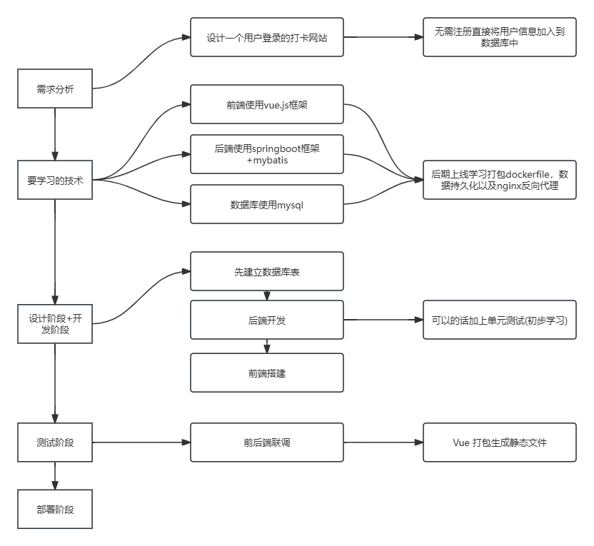
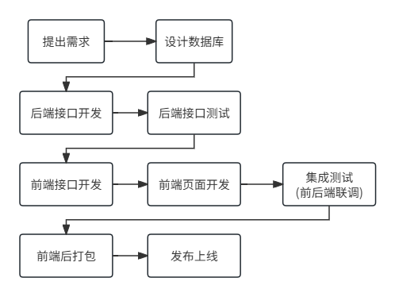

## 流程确定



## 业务逻辑&需求

需要两张表，分别是用户信息表和打卡记录表。

**用户信息表(暂定)**

| 字段名                | 类型    | 长度(位) | 键   | 注释                           |
| --------------------- | ------- | -------- | ---- | ------------------------------ |
| user_id               | bigint  | 64       | 主键 | 用户id                         |
| name                  | varchar | 24       | 唯一 | 用户昵称                       |
| password_hash         | varchar | 24       |      | 用户密码 加密                  |
| points                | int     | 32       |      | 用户积分 默认为0               |
| sport_current_streak  | int     | 32       |      | 运动连续打卡的天数 默认为0     |
| sport_last_check_date | date    | 32       |      | 运动上次打卡的日期 默认为null  |
| study_current_streak  | int     | 32       |      | 学习用户连续打卡的天数 默认为0 |
| study_last_check_date | date    | 32       |      | 学习上次打卡的日期 默认为null  |

**新用户信息表(暂定)**

| 字段名        | 类型     | 长度(位) | 键   | 注释             |
| ------------- | -------- | -------- | ---- | ---------------- |
| user_id       | bigint   | 64       | 主键 | 用户id           |
| name          | varchar  | 24       | 唯一 | 用户昵称         |
| password_hash | varchar  | 32       |      | 用户密码 加密    |
| points        | int      | 32       |      | 用户积分 默认为0 |
| create_time   | datetime | 64       |      | 用户创建时间     |

**(新增)用户打卡进度表(暂定)**

| 字段名             | 类型    | 长度(位) | 键   | 注释                      |
| ------------------ | ------- | -------- | ---- | ------------------------- |
| user_id            | BigInt  | 64       | 唯一 | 用户id                    |
| check_type         | tinyint | 8        | 唯一 | 0表示运动 1表示学习       |
| last_check_date    | date    | 32       |      | 上次打卡的日期 默认为null |
| current_streak     | int     | 32       |      | 连续打卡的天数 默认为0    |
| continuous_missing | tinyint | 8        |      | 缺失打卡天数 默认为0      |

**打卡记录表(暂定)**

| 字段名        | 类型     | 长度(位) | 键   | 注释                |
| ------------- | -------- | -------- | ---- | ------------------- |
| check_id      | BigInt   | 64       | 主键 | 打卡记录的id        |
| user_id       | BigInt   | 64       | 唯一 | 打卡的用户id        |
| check_in_date | date     | 32       | 唯一 | 打卡日期            |
| check_time    | datetime | 64       |      | 记录创建时间        |
| check_type    | tinyint  | 8        | 唯一 | 0表示运动 1表示学习 |
| check_content | varchar  | 255      |      | 打卡内容备注        |

**user_id+check_in_date+check_type联合唯一**可以保证用户不能在同一天同类别在数据库中插入数据**(数据库层面保证不能重复打卡)**

**打卡行为**：用户每天打卡会在数据库里添加一条记录，个人积分加1分。如果连续打卡7天，额外加1分；连续14天额外加2分；21天额外加3分。当连续打卡的天数n每次达到7的倍数，则将该用户在用户信息表中的积分信息添加n/7分。

**惩罚约定：**当用户连续三天未进行打卡时，则将该用户在用户信息表中的积分信息扣除1分，此后未打卡的天数信息n每次达到3的倍数时，用户都需要被扣除1分，直至为0(用一个max(0， points-1)比较)

**行为约定**：需要约束用户的打卡记录，用户有两个打卡行为，分别是运动打卡和学习打卡，两个打卡每人每天只能分别进行一次打卡，并且两个连续打卡和打卡惩罚独立计算

## 项目流程(GPT版)

#### **1. IDEA 创建 Spring Boot 项目** 

#### **2. 配置 Spring Boot**

- 在 

  ```
  application.yml
  ```

   或 

  ```
  application.properties
  ```

   配置：

  - **数据库连接（MySQL）**
  - **日志级别**
  - **服务端口**

#### **3. 数据库设计 & 建表**

- 在 MySQL 中创建数据库（`打卡系统`）
- 根据你的表结构，编写 SQL 建表语句

#### **4. 编写 Entity 类**

- 创建 **用户信息表**、**打卡记录表**、**用户打卡进度表**的 `Entity`
- 使用 `Spring Data JPA` 定义 `Repository`

#### **5. 设计业务逻辑**

- 用户管理（注册、登录、查询）
- 打卡管理（打卡、查询记录、计算积分）
- 惩罚 & 奖励机制（连续打卡、缺勤扣分）

#### **6. 实现 API**

- 编写 `Controller`
- 定义 `DTO`（数据传输对象）
- 处理 `Service` 逻辑

#### **7. 用户认证**

- 使用 JWT 进行身份认证
- 保护 API（只有登录用户才能访问）

#### **8. 业务测试**

- **Postman** 或 **Swagger** 测试 API
- 校验业务逻辑是否符合预期

#### **9. 任务调度**

- 定时检查用户未打卡并扣分（`@Scheduled`）

#### **10. 部署上线**

- 打包 `JAR`
- 部署到 **华为云服务器**
- 配置 **Nginx + HTTPS**
- 使用 **Redis** 进行优化

## 项目流程

#### **1、IDEA初始化Spring Boot 项目** 

#### 2、配置JDBC，检测数据库连接

#### 3、SQL语句创建数据表

#### 4、myBatis开启驼峰命名映射，根据数据表编写实体类

#### 5、database->右键table->tools->scripted extensions->Generate POJOs.groovy快速生成实体类

#### 6、创建controller、service、mapper文件夹

#### 7、controller 层调用 Service 层的方法，Service 层定义方法接口，ServiceImpl实现

#### 8、按照顺序编写

1. 实体类生成之后编写数据库访问接口
2. service接口定义方法
3. serviceImpl实现业务逻辑
4. 按需创建前端的接口

9、postman本地测试

10、前端


mybatis-plus需要在实体类加上@TableName("check_record")注解 需要指明主键


打卡逻辑和奖励惩罚解耦

CheckInServiceImpl的checkin方法只实现用户的打卡行为和基础加分，并且在打卡记录表中添加数据，更新用户的points和打卡进度表中的上次打卡天数

UserCheckProgressService定义奖励方法和惩罚方法

UserCheckProgressService


```shell
docker-compose up -d --no-deps --build checkWeb
无需全部重新构建，后端更新时上传jar包并重新构建checkWeb
前端更新上传到html 重启nginx挂载一下
```


#### ③ 后端接口开发

- **实体类 (Entity)**：创建 `ScoreRank` 对象。
- **Mapper**：编写数据库访问接口。
- **Service (接口层)**：定义查询排行榜的方法。
- **ServiceImpl**：实现排行榜的查询逻辑，支持分页或筛选条件。
- **Controller**：创建接口 `/rank/list`，接收查询参数并返回排行榜数据。

## 整体开发流程


### 具体功能

#### 提出需求：



心愿商城

主体逻辑

用户本体创建表单，提交表单之后刷新出现自己提交的表单 使用积分兑换自己的表单

数据库：

心愿表 userid wishid wishname wishcategory wishpoint wishphoto wishdesc wishstatus createtime

兑换记录表 redeemid userid wishid  exchangetime 

controller 

/wish/submit提交表单

/wish/myInfo获取自己的表单

/exchange/redeem 兑换商品

/exchange/record 查询兑换记录


