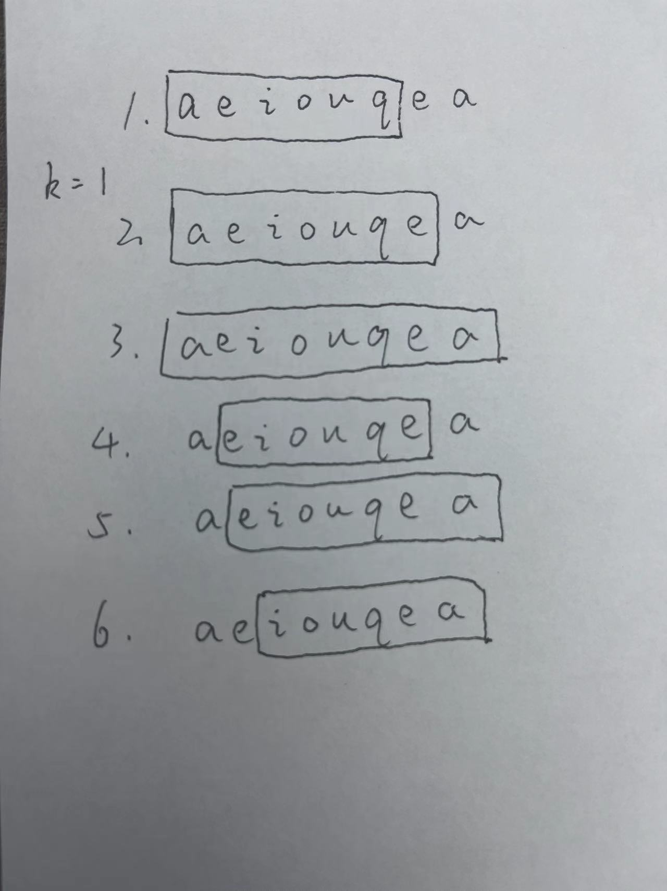
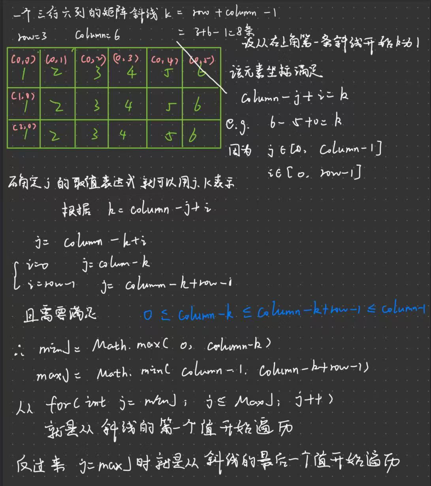

# 持续学习是重中之重--坚持

## [135. 分发糖果](https://leetcode.cn/problems/candy/)（困难）

##### 原本思路：

1. 获取数组中从小到大值的索引排序数组
2. 创建与ratings长度一样的数组并且全部填充为1
3. 对数组两端进行特殊处理，最左端只和右边的比较，最右端只和最左端的比较
4. 对于数组中间的数索引i，先处理i自身的糖果增加，在处理两边的糖果增加

##### 改进思路：

贪心算法碰到两边需要比较的时候，先正序遍历处理一边的比较，再倒序遍历处理一边的比较

倒序比较时与之前的所在索引处的糖果数进行比较，保留较大的那个值

## [3305. 元音辅音字符串计数 I](https://leetcode.cn/problems/count-of-substrings-containing-every-vowel-and-k-consonants-i/)（中等）

##### 原本思路：

每次判断滑动窗口中的aeiou个数是否都超过1，并且如果aeiou个数总和+k = 滑动窗口大小则视为一个有效字符串

滑动窗口的初始大小定为5+k，i的范围是初始字符串的长度-（k+5）

每次滑动窗口从索引i开始，每次窗口向右移动一步，窗口右边界达到字符串的末尾时，滑动过程结束，i+1



##### 优化思路：

不定长窗口

Hash优化

## [1. 两数之和](https://leetcode.cn/problems/two-sum/)

##### 原本思路：

暴力破解

双重循环，外层循环从i=0开始，内层循环从j=i+1开始，直至出现

```java
nums[i]+nums[j]=target
```

为止

##### 优化思路：

使用哈希表

```java
HashMap<Integer,Integer> hash = new HashMap<>();
```

哈希表使用的是键值对存储方式

遍历整个数组，每次遍历查找哈希表中是否存在target - nums[i]的值，存在则返回当前索引i和哈希表中的value

```java
//新写法
return new int[]{hash.get(target - nums[i]),i};
```

不存在则将nums[i]和i按照key-value的形式存入哈希表

## [1512. 好数对的数目](https://leetcode.cn/problems/number-of-good-pairs/)

##### 原本思路：

思路转换成求相同值的个数并对每个相同值的个数n进行n-1项的高斯求和

Hash Map的key表示数组中的值，value表示该值的个数

```java
collection<Integer> va = hash.value();
```

获取一个包含Hash Map中value的集合，对集合中的每个值进行n-1项的高斯求和

对上一步每个得出来的和进行最后的求和

## [128. 最长连续序列](https://leetcode.cn/problems/longest-consecutive-sequence/)

##### 学习思路：

首先使用集合 对数组去重

```java
HashSet<Integer> set = new HashSet<>();
for(int num:nums){
    set.add(num);
}
```

此时数组中所有的元素都以不重复的形式放在集合中

**巧解：**要找到最长的连续序列， 遍历当前集合

```java
for(int x:set){}
```

如果存在x-1这个数，就说明最长的连续序列是不以x开头的

如果不存在x-1这个数，就说明x是某个序列的开头，不停的迭代寻找x+1是否存在集合之中，记录这个序列长度

```java
currentStreak = Math.max(currentStreak, y-x);
```

得出最大的序列长度

## [2610. 转换二维数组](https://leetcode.cn/problems/convert-an-array-into-a-2d-array-with-conditions/)

##### 原本思路：

通过hashMap获得所有数字和数字出现的次数

遍历key-value，如果一个key的value>=1，则将key加入到集合中

```java
for(Map.Entry<Integer, Integer> entry:hash.entrySet()){
    if(entry.getValue()>=1){
        keys.add(entry.getKey());
    }
//hash.entrySet() 获取hashmap中所有的键值对的集合
//Map.Entry<Integer, Integer> entry 表示单个键值对
//entry.getValue() 获取单个键值对中的值  entry.getKey()获取单个键值对的键
```


因为所有key在hashMap中的value一定>=1，每次遍历将所有key的value-1，如果value=0则删除这个key

## [3446. 按对角线进行矩阵排序](https://leetcode.cn/problems/sort-matrix-by-diagonals/)&[2711. 对角线上不同值的数量差](https://leetcode.cn/problems/difference-of-number-of-distinct-values-on-diagonals/)

##### 学习思路：

遍历矩阵中对角线上的元素

```java
int row = grid.length; int column = grid[0].length; //获取二维矩阵的行和列
int[][] ints = new int[row][column];
for(int k=1;k<column+row;k++){ //一个二维矩阵有(row+column-1)条斜线
    int minJ = Math.max(column-k,0);
    int maxJ = Math.min(column-k+row-1,column-1);
    for (int j = minJ; j < maxJ+1; j++) {
        list.add(grid[k+j-column][j]);
    }
```



从斜线遍历矩阵

**题1**按对角线进行矩阵排序，用**列表**将对角线数据存储

```java
List<Integer> list = new ArrayList<>();
list.sort();
```

之后进行排序

**题2**按对角线进行矩阵排序用**集合**先将对角线数据存储

```java
HashSet<Integer> set = new HashSet<>();
for(int k=1; k<column+row; k++){ //k是斜线
    int minJ = Math.max(0, column-k);//i，j分别表示该点的横纵坐标
    int maxJ = Math.min(column-1,column-k+row-1);
    set.clear();
    for (int j=minJ; j<= maxJ; j++){
        ints[j+k-column][j] = set.size(); //集合的size表示上半斜线的不同值的个数
        set.add(grid[j+k-column][j]);
    }
    set.clear();
    for (int j=maxJ; j>=minJ; j--){
        ints[j+k-column][j] = Math.abs(ints[j+k-column][j]-set.size());
        set.add(grid[j+k-column][j]);
    }
}
```

按对角线遍历

先从这条对角线**从上至下**方向开始遍历，将每个点的**上半斜线**先存入数组中

再从这条对角线**从下至上**方向开始遍历，将每个点的**下半斜线**不同值的个数与上半斜线不同值的个数相减求绝对值

[231. 2 的幂](https://leetcode.cn/problems/power-of-two/)

```java
return n>0 && (n&(n-1))==0;
```

位运算，由于奇数2进制表示末尾一位一定为1，且2的幂只有都是10，100，1000，和2进行位运算**一定为0**

[1422. 分割字符串的最大得分](https://leetcode.cn/problems/maximum-score-after-splitting-a-string/)

先统计字符串中所有的'1'的个数，假定为最多的分数

```java
char[] ch = s.toCharArray();//将字符串中的字符存入数组
```

遍历索引[0, s.length-2]，当该数为'0'时，则将左边的分数增加，当该数为'1'时，则将右边的分数减少，因为本是右边的1到了左边则不计分

每次遍历结束判断

```java
maxScore = Math.max(leftScore+rightScore,maxScore);
```

## [3396. 使数组元素互不相同所需的最少操作次数](https://leetcode.cn/problems/minimum-number-of-operations-to-make-elements-in-array-distinct/)

##### **原本思路：**

从头开始遍历数组，将每个数和这个数的出现次数存入hashMap中，每次检查hashMap是否存在当前值

如果存在，进行循环，跳出循环的条件是hashMap不存在这个Key，每次循环删除头3个进入hashMap的值，记录一次操作，并修改下次遍历数组的索引**为Max（最后删除的值的下个索引，当前值的索引）**

```java
if(i<index){
    i = index;
}
```

**巧解：**

从头开始寻找，每次都是移除nums的前缀

**换个思路，从尾部开始寻找，找到一个尽可能长的重复的后缀，对剩下数组长度除以3向上取整则为操作的次数**

考虑使用集合，当有值和集合中的值重复时停止循环

```java
Set<Integer> set = new HashSet<>();
for(int i=nums.length-1;i>=0;i--){
    if(!set.add(nums[i])){ //set的add方法返回是Boolean 没有添加成功说明重复
        return i/3+1;
	}
}
```

## [3375. 使数组的值全部为 K 的最少操作次数](https://leetcode.cn/problems/minimum-operations-to-make-array-values-equal-to-k/)

##### 思路：

1. 准备一个集合，每次遍历，首先辨别是否存在比k小的数，存在则无法使所有数都变为k，返回-1
2. 判断是否是否新的数大于k且不存在集合中，存在这样的数则需要操作一次

本质上这题是判断严格大于k的不同数的个数

## [2141. 同时运行 N 台电脑的最长时间](https://leetcode.cn/problems/maximum-running-time-of-n-computers/)

**思路：**

根据题目意思，本质上只要找到一个最大的时间数`P`，满足`k`台电脑能同时在`p`分钟内运行

想办法填满这个`p*k`的矩阵，且每一行不能使用相同的一块电池

**巧解：**

首先考虑使用二分，最好情况是每个电池使用时间都相同且电池数量能整除电脑数，此时的运行时间为`sum(batteries)/n`，最坏情况是电池数小于电脑数，无法满足所有电脑同时充电

在范围`[0,sum(batteries)/n]`二分确定时间`p`，对于给定时间`p`，将所有的电池进行分类

对于大于等于`p`的电池，使用`p`分钟填满一列矩阵，剩余的舍弃，因为同一行不能出现相同颜色的电池

对于小于`p`的电池，只需要考虑小于`p`的电池和是否足够填充剩下的矩阵，因为本身不满足填满一整列，不会出现同一行出现相同颜色的情况

简洁写法是对`p`和`batteries[i]`进行比较，取较小的部分相加最后判断`sum`是否大于等于`p*k`即可


