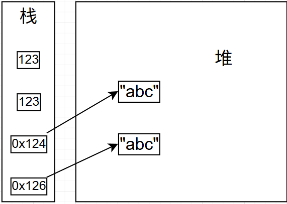
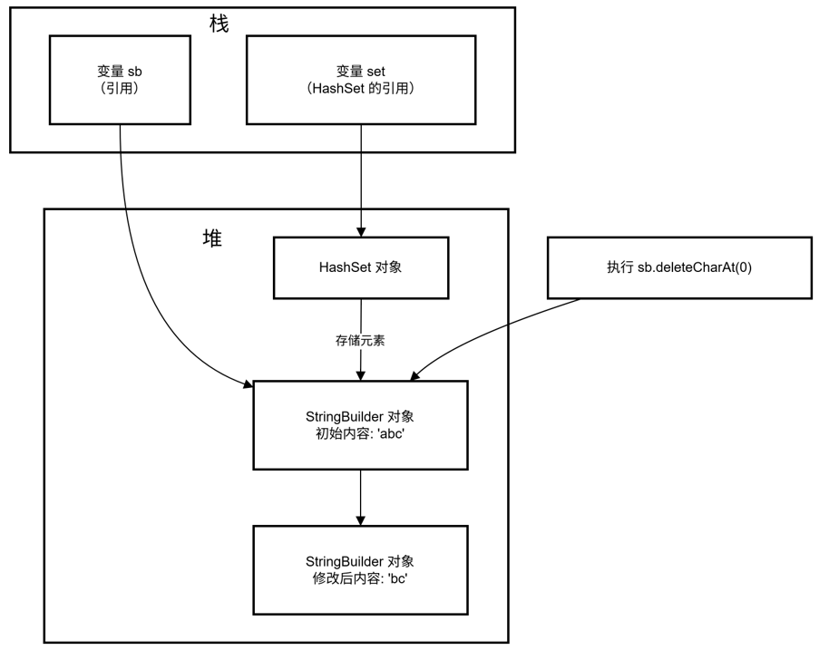

# HashMap

## 基础方法

``` java
HashMap<Integer, String> hash = new HashMap<>();
//put方法往哈希表中加入数据
hash.put(1,"string1"); 

//返回key=1的value
hash.get(1); 

//替代哈希表中对应key的value值
hash.replace(1,"string2"); 

//获取key为1的value，如果没有返回定义的默认值
hash.getOrDefault(1,null); 

//判断hash表中是否存在key=1的键值对，存在返回true，否则false
hash.containsKey(1); 

//返回包含所有value的集合
Collection<Integer> va =  hash.values(); 

//删除key=1的键值对
hash.remove(1);

//清空
hash.clear();

//结合使用
//向hash表中加入key和value，这一步用来统计数字出现次数好用，如果第一次出现则默认值加1，否则在原来的基础数字出现次数上+1
hash.put(1,hash.getOrDefault(1, 0)+1); 

//三个参数，hash表的key，第二个是如果不存在该key，则给予的默认值，第三个是后续相同key冲突时，如何将旧值（oldValue）和新值（newValue）的结合方法
hash.merge(key, value, remappingFunction);

//hash.merge(num[i], 1, Integer::sum)作用等同于hash.put(1,hash.getOrDefault(1, 0)+1); 
hash.merge(num[i], 1, Integer::sum);

//使用hashMap存储一个值及其对应的索引，索引放在列表中，computeIfAbsent是如果不存在列表则新建一个列表
map.computeIfAbsent(nums[i], k -> new ArrayList<>()).add(i);
```

## 底层

## equals()和hashCode()

### equals()方法

默认情况下,`equals()`比较的是对象的引用地址，也就是栈中地址值，但是每次new一个对象的地址是不一样的，但是大多时候我们都是需要比较地址对应的值是否一样，因此直接使用`equals()`会有问题

```java
public class Packet{
    int source,destination,timestamp ;
    public Packet(int source, int destination, int timestamp){
        this.source = source;
        this.destination = destination;
        this.timestamp = timestamp;
	}
    public static void main(String[] args) {
        Packet p1 = new Packet(1,1,1);
        Packet p2 = new Packet(1,1,1);
        //这里比较的是栈中的地址值
        System.out.println(p1.equals(p2));//false
    }
}

```



### 重写equals()方法

大部分情况我们都是需要比较值是否一致，而不是根据引用。例如，对于 `String` 类，我们希望只要两个字符串的内容相同，就认为它们相等。 这时，我们就需要 *重写* `equals()` 方法。

```java
int a = 123;
int b = 123;
String str1 = "abc";
String str2 = "abc";

//基础类型的变量直接存放栈中，比较值，没有equal方法
system.out.println(a==b);//true

//String重写equals方法，比较hashCode和值
system.out.println(str1.equals(str2));//true
```

**重写`equals()`** 

1. `this`和`obj`分别表示p1和p2的引用地址，如果地址相同则值一定相同，性能优化
2. 如果p2的地址为空或者p2和p1都不是一个类也没必要比较，直接返回false
3. 最后逐一参数的值进行比较，全部相同才返回true

```java
import java.util.Objects;
 
class Person {
    private String name;
    private int age;
 
    public Person(String name, int age) {
        this.name = name;
        this.age = age;
    }
 
    @Override
    public boolean equals(Object obj) {
        if (this == obj) return true;
        if (obj == null || getClass() != obj.getClass()) return false;
        Person person = (Person) obj;
        return age == person.age && Objects.equals(name, person.name);
    }
 
    @Override
    public int hashCode() {
        return Objects.hash(name, age);
    }
    
    public static void main(String[] args) {
        Person p1 = new Person("zhangsan",18);
        Person p2 = new Person("zhangsan",18);
        //全部值相等
        System.out.println(p1.equals(p2));//true
    }
}
```

**注：**

基本类型直接使用值比较，引用类型使用`Objects.equals()`

由于a，b本质上还是`String`类，所以`a.equals(b)`会变成`String`类的比较

`String`类已经重写了`equals()`方法，所以是值的比较

```java
public static boolean equals(Object a, Object b) {
    return (a == b) || (a != null && a.equals(b));
}
```

### hashCode()方法

`hashCode()`方法用于返回对象的哈希码值。默认情况下，`Object` 类的 `hashCode()` 方法通常（但不保证）返回基于对象 *内存地址* 的一个整数值。用于在哈希表（例如 `HashMap`、`HashSet`）中快速查找对象。

```java
String s = "hello";
// 哈希码，可能是 99162322
int hash = s.hashCode(); 
```

### 重写hashCode()

```java
@Override
public int hashCode(){
    return Objects.hash(name,age);
}
```

### java关于hashCode的约定

- 只要对象的 `equals` 方法的比较操作所用到的信息没有被修改，那么对这同一个对象调用多次，`hashCode` 方法都必须始终如一地返回同一个整数。
- 对象相等，hashCode一定相等
- hashCode相等，对象不一定相等(例如在一个桶里，但是值不一样)

### **为什么需要同时重写 `equals()` 和 `hashCode()`**

以上述`person`类为例，没有重写`hashCode()`方法，两个对象的hashCode并不一样，但是值却是一样的

使用`hashSet`，发现由于`hashCode`不同，最后两个对象放入的**桶**也会不同，因此造成值明明一样，但是`set`仍然存放了两个`person`对象

```java
Person p1 = new Person("zhangsan", 18);
Person p2 = new Person("zhangsan", 18);

System.out.println(p1.hashCode());     // 189568618
System.out.println(p2.hashCode());     // 793589513

Set<Person> set = new HashSet<>();
set.add(p1);
set.add(p2);
System.out.println(set.size()); //输出2
```


## 问题

# TreeMap

TreeMap和HashMap的区别是：

TreeMap的key都是有序的，HashMap的key是无序的

TreeMap的查找index时间是**`O(logn)`**，HashMap的查找index时间**`O(1)`**

TreeMap底层基于是基于红黑树，HashMap底层基于数组+链表+红黑树

```java
//基础方法和HashMap大差不差
TreeMap<Integer, Integer> treeMap = new TreeMap<>();

treeMap.put(3,1);
```


# ArrayList

```java
List<Integer> list = new ArrayList<>();
//将值按顺序放到列表中
list.add(1);

//将列表原地排序,默认正序
list.sort([Comparator.naturalOrder() || Comparator.reverseOrder()]);

//先了解
people.sort(Comparator.comparingInt(p -> p.age));

//list配合map使用 如果是新值则新建一个ArrayList并将索引放入list中， lambda表达式,
map.computeIfAbsent(nums[i], k -> new ArrayList<>()).add(i);
```

# LinkList

链表，可以指定从头部或者尾部插入数据

相较于列表，可以直接打造有序，省去排序的时间

```java
LinkedList<Integer> list = new LinkedList<>();
//从尾部插入数据
list.addLast(2);

//从头部插入数据
list.addFirst(1);
```


# String

String的方法

```java
//字符串转化为字符数组
char[] ch = str.toCharArray();

//判断字符串中是否存在某个字符个数是否>=0
boolean isVowel = str.indexOf(b) >= 0;
```


```java
String a = "abc";String b = "a";
/*
两个结果一样但是运行速度不一样，result1由于ab已经在常量池中存在，需要重新new一个字符串并且再运行一遍，而result2是在编译时拼接，所以只需要一遍即可
*/
String result1 = a+b;
String result2 = "abc" + "a";
//a+b的底层原理就是new StringBuilder().append(a).append(b).toString()
a+b; 
```

```java
//为什么同样的循环a+b会超时？
String[] str = {"ab","cd","ef","gh"}
string c = "";
for(int i=0;i<str.length;i++){
	c += str[i];
}
//等于
for(int i=0;i<str.length;i++){
    c = new StringBuilder().append(c).append(str[i]).toString;
}
//需要每次新建一个stringbuilder之后再拼接在转换为字符串

//先建立stringbuilder存储最后转化为字符串，省去中间new stringbuilder和复制之前所有字符的内容
StringBuilder sb = new StringBuilder();
for(int i=0;i<str.length;i++){
    sb.append(str[i]);
}
c = sb.toString();
```

String不可变的原因
1.String是final类型的类，value也是final类型的数组，但这不是String不可变的根本原因，String不可变是因为value是private，且并没有提供对外的get和set
2.底层char[]数组有final修饰，意味着这个数组不能扩容等，来达到存更多的字符，final修饰char类型数组，保证数组一旦被赋值 不能在重新赋值，修改char类型数组后，地址不能改变，内容可变，但是没有具体的方法去修改内容
3.char[]数组是私有的，我们程序员无法直接操作这个char[]数组，而且String没有提供这样的方法，来修改char[]数组的元素的值。

String不可变的好处
可以共享，也是为了安全

# Set

```java
Set<Integer> set = new HashMap<>();
//set.add方法返回boolean，如果为true则添加成功，false则添加失败
boolean flag = set.add(1);;
```

##### set和SrtingBuilder的冲突

```java
Set<SrtingBuilder> set = new HashSet<>();

//SrtingBuildernew出对象后，之后的所有操作不会改变内存地址
StringBuilder sb = new StringBuilder();

//集合中存储的是 sb 的引用（即内存地址），而非 StringBuilder 对象的拷贝
set.add(sb);

//集合中存储的是 sb 的引用,sb进行操作之后，集合访问该引用会变成修改后的内容
sb.deleteCharAt(0);
```


# SrtingBuilder

```java
//字符串拼接使用stringBuilder,append方法将要拼接的字符放到当前字符串后面，避免使用a+b
StringBuilder sb = new StringBuilder();
sb.append("a");
sb.toString();

//根据索引删除StringBuilder中的内容，但是注意sb是会动态维护的
//在循环中每一次删除最左边的值
sb.deleteChatAt(0);

//清空stringBuilder
sb.setLength(0);
```



# StringBuffer

# Array

```java
//将指定数组填充为指定值，数组必须为1维数组
Arrays.fill([数组], [填充值]); 

//lambda写法，将list中的数据按顺序放到数组中
Integer[] arr = nums.toArray(Integer[]::new);

//字符串划分成每个字符存到字符数组中
char[] ch = s.toCharArray();

//数组原地排序
Arrays.sort([数组], [start index], [end index]);

//数组装箱,int[]转为Integer[]
Arrays.stream(nums).boxed().toArray(Integer[]::new);    
```


