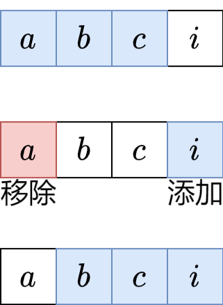
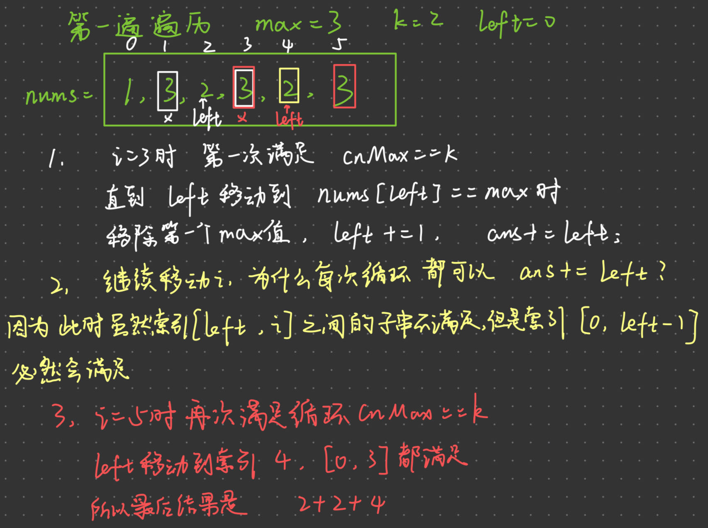

### [1456. 定长子串中元音的最大数目](https://leetcode.cn/problems/maximum-number-of-vowels-in-a-substring-of-given-length/)

##### 原本思路：

根据窗口长度，挨个窗口遍历，统计每个窗口的元音个数，放回最大长度的元音个数

#### 学习思路(定长滑动窗口模板)：



如果已经计算出来abc的元音字符串个数，我们只需要判断**需要离开的a**和**新进入的i**是不是元音字符串，在这个基础上直接进行元音个数的相加减就可以得出新窗口的元音个数

### [2841. 几乎唯一子数组的最大和](https://leetcode.cn/problems/maximum-sum-of-almost-unique-subarray/)

#### hash表和定长滑动窗口的结合

```java
//hash表统计每个数字以及其出现的次数
HashMap<Integer, Integer> map = new HashMap<>();
map.put(arr[i],map.getOrDefault(arr[i],0)+1);
```

```java
//hash表的size表示不重复的数
if(map.size() >= m){
    maxSum = Math.max(sum,maxSum);
}

//当哈希表的大小满足m时，说明此时的滑动窗口可以计算最大和
//在计算之后，sum移除arr[i-k+1]的值
//注意的是哈希表的变化，同样也减少一次key=arr[i-k+1]的值，如果次数变为0说明滑动窗口不存在该值，从hash表中remove
int out = arr[i-k+1];
sum -= out;
int value = map.get(out);
if(value > 1){ //说明滑动窗口里存在多个相同的值
    map.put(out, value -1);
}else{
    map.remove(out);
}
```

## [3306. 元音辅音字符串计数 II](https://leetcode.cn/problems/count-of-substrings-containing-every-vowel-and-k-consonants-ii/)

### 至少型不定长滑动窗口

[2962. 统计最大元素出现至少 K 次的子数组](https://leetcode.cn/problems/count-subarrays-where-max-element-appears-at-least-k-times/)

```java
/*
遍历数组的同时，判断是否满足条件
*/

//至少型滑动窗口的条件
while(cnt>=k) ||  while (map.size()==5 && cnt >= k){}

//首先理解，进入循环说明从left到right的这个字串是满足条件的
//在循环之内移动left指针
ans += left;
```

以`nums` = `[1,3,2,3,2,3]`, `k` = `2`为例



#### 注意

其实刚开始思路是一样的，都是想着找到满足要求时停下右指针，开始移动左指针

但是我的想法是直接加上右指针之后的，每次加上`ans+=(length-right)`，因为右指针之后的一定满足，移动左指针直至不满足要求在继续移动右指针

**优化思路**：`ans+=(length-right)`改为`ans += left`，当满足时也是移动`left`，但是之后的一定会满足索引`[0,left-1]`到`right`的字串，代码写法要简单许多

### 恰好型滑动窗口

每个**元音字母**至少各一次，且**辅音字母**个数恰好为k

恰好型滑动窗口转化成 至少k个辅音字母 减去 k+1个辅音字母