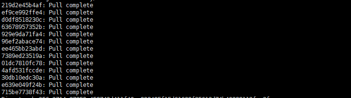
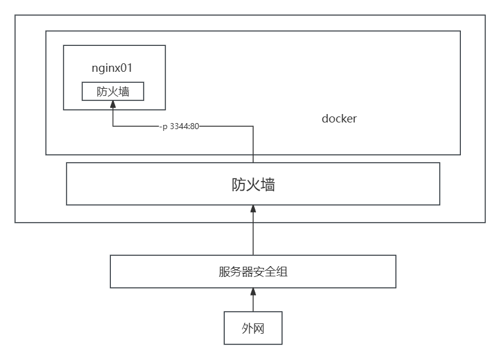
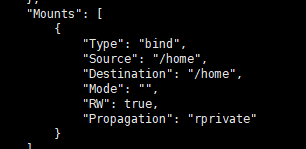

# Docker

为什么学docker

使用docker实现的功能

## 安装docker

https://docs.docker.com/官方文档（翻墙）

linux里yum和dnf 都是包管理工具，在centos8之后dnf用的较多，docker官方文档提供的都是dnf命令

- linux命令

```bash
#查看系统内核
[root@hcss-ecs-072c /]# uname -r
3.10.0-1160.119.1.el7.x86_64
```

```shell
#查看系统版本
[root@hcss-ecs-072c /]# cat etc/os-release
NAME="CentOS Linux"
VERSION="7 (Core)"
ID="centos"
ID_LIKE="rhel fedora"
VERSION_ID="7"
PRETTY_NAME="CentOS Linux 7 (Core)"
ANSI_COLOR="0;31"
CPE_NAME="cpe:/o:centos:centos:7"
HOME_URL="https://www.centos.org/"
BUG_REPORT_URL="https://bugs.centos.org/"

CENTOS_MANTISBT_PROJECT="CentOS-7"
CENTOS_MANTISBT_PROJECT_VERSION="7"
REDHAT_SUPPORT_PRODUCT="centos"
REDHAT_SUPPORT_PRODUCT_VERSION="7"

#查看系统进程信息
ps -ef
```

- docker安装流程

```shell
1、#卸载旧的docker包
yum remove docker \
                  docker-client \
                  docker-client-latest \
                  docker-common \
                  docker-latest \
                  docker-latest-logrotate \
                  docker-logrotate \
                  docker-engine
 
2、#安装工具包
yum install -y yum-utils

3、#设置镜像仓库
yum-config-manager \
  --add-repo \
  http://mirrors.aliyun.com/docker-ce/linux/centos/docker-ce.repo ##阿里云镜像

4、#安装docker engine
yum install docker-ce docker-ce-cli containerd.io docker-buildx-plugin docker-compose-plugin

5、#启动docker
sudo systemctl enable --now docker

6、#查看docker版本
docker version

7、#hello world
sudo docker run hello-world

```

### 安装docker问题

使用docker run hello-world显示超时信息，估计是因为使用了最新的docker引擎，阿里云镜像的问题

```shell
#删除json文件
sudo rm -r /etc/docker/daemon.json
#创建一个新的 daemon.json
sudo touch /etc/docker/daemon.json
#使用 vi命令来添加内容
sudo vi /etc/docker/daemon.json
#插入以下 JSON 内容
{
  "registry-mirrors": [
    "https://docker.registry.cyou",
    "https://docker-cf.registry.cyou",
    "https://dockercf.jsdelivr.fyi",
    "https://docker.jsdelivr.fyi",
    "https://dockertest.jsdelivr.fyi",
    "https://mirror.aliyuncs.com",
    "https://dockerproxy.com",
    "https://mirror.baidubce.com",
    "https://docker.m.daocloud.io",
    "https://docker.nju.edu.cn",
    "https://docker.mirrors.sjtug.sjtu.edu.cn",
    "https://docker.mirrors.ustc.edu.cn",
    "https://mirror.iscas.ac.cn",
    "https://docker.rainbond.cc"
  ]
}
#重启docker
sudo systemctl restart docker
```

## Docker常用命令

### 镜像命令

**查看所有镜像信息**

```shell
#docker images --help
docker images
  -a, --all             #显示所有docker镜像（默认）
      --digests         #显示签名
  -q, --quiet           #只显示docker imagesID
  -aq					#显示所有的docker imagesID
```

 **从dockerhub下载对应的镜像**

```shell
#docker search --help
docker search 镜像名
  --filter				#按照条件筛选
 docker search mysql --filter=STARS=5000 #筛选dockerHub中STARS>=5000的mysql
```

**下载（拉取）镜像**

```SHELL
docker pull 镜像名
docker pull mysql[:版本号]
docker pull mysql:5.7 #版本号需存在hub上 默认下载最新版
```

**分层下载**

docker下载镜像一层一层下载，分层的好处就是不会下载重复内容，同一文件不同版本只会下载更新的内容，节省内存



在使用镜像时，会在镜像之上添加一个容器层（可写层），不会对原镜像层发生改变

**删除镜像**

```shell
docker rmi -f images ID
docker rmi -f images ID  #强制删除镜像
docker rmi -f $(docker images -aq) #删除所有镜像
```

### 容器命令

有镜像才可以创建容器

**运行容器**

```shell
docker run  [参数]  images  
  --name								#用来区分容器名称
 docker run --name centos(容器名) centos(镜像名)
  -d									#后台运行
  -it									#交互式运行
  -p(小写)							   #指定容器端口
  		-p ip: 主机端口:容器端口
  		-p 主机端口:容器端口
  		-p 容器端口
  		容器端口
  -P(大写)							   #随机指定端口
```

**查看正在运行的容器**

```shell
docker ps               #显示正在运行的容器
  -a, --all             #显示正在运行的容器+显示所有运行过的容器
  -f, --filter filter   #根据条件筛选
  -n, --last int        #显示最近创建的容器
docker ps -n=?
  -l, --latest          #显示最近运行的一个容器

  -q, --quiet           #只显示容器的编号
  -s, --size            #显示容器的大小

```

**退出容器即停止**

```shell
exit			#退出容器即停止
ctrl + P + Q	#退出但不停止
```

**删除指定容器，不能删除正在运行的容器**

```shell
docker rm 容器id 
docker rm -f $(docker ps -aq) #-f（强制删除） 强制删除所有容器
docker ps -a -q|xargs docker rm #删除所有容器
```

```shell
docker start 容器id  #启动容器
docker restart 容器id#重启容器
docker stop 容器id   #停止容器
docker kill 容器id   #kill容器
```

### 常用其他命令

```shell
docker run -d 镜像名   #后台运行容器
```

容器如果没有前台进程，则会自动kill

**查看容器的日志输出**

```shell
docker logs 容器id 
	-t       	#显示时间戳
	-f		 	#显示日志
	--tails n	#字符串输出 n为输出条数
docker logs -tf --tails 10 容器id/容器name
```

```shell
docker top 容器id/容器name 		#查看容器的进程信息
docker inspect 容器id/容器name  #查看容器的源数据
```

**进入正在执行的容器**

```shell
docker exec  -it  容器id/容器name /bin/bash  
docker attach 容器id/容器name  #进入容器正在执行的终端  和screen的attach相似
```

**从容器拷贝文件到主机上**

```shell
docker cp 容器id/容器name:容器的文件目录 主机目录
```

## Docker部署nginx

**firewalld命令**

```shell
#firewalld添加端口
sudo firewall-cmd --zone=public --add-port=3344/tcp --permanent
#查看firewalld配置
sudo firewall-cmd --list-all
#查看日志
sudo tail -f /var/log/messages
#拦截信息
Nov 14 11:51:49 hcss-ecs-072c kernel: IN_public_DROP: IN=eth0 OUT= MAC=fa:16:3e:78:d1:be:fa:16:3e:9c:d1:b9:08:00 SRC=103.255.222.88 DST=192.168.1.238 LEN=40 TOS=0x10 PREC=0x80 TTL=46 ID=52314 PROTO=TCP SPT=46426 DPT=22 WINDOW=0 RES=0x00 ACK RST URGP=0
#每次设置完firewalld要重置
sudo firewall-cmd --reload
```

问题：docker略过宿主机的防火墙，导致centos的防火墙开与不开没有关系

将docker的"iptables": false，docker绕过防火墙的原理是修改了iptables，不能在iptables添加任何规则，使用防火墙来管理docker容器的端口



## Docker部署tomcat

## Docker部署es+Kibana(微服务)

注意内存占用

## 可视化(portainer)

## Commit镜像

**提交镜像**

```shell
docker commit -m="描述的信息" -a="作者" 容器id/容器名称 目标镜像名称：[TAG(version)]
```

## 容器数据卷

容器的持久化和同步操作

命令挂载

```shell
docker run -it -v 主机目录:容器内目录 -p 主机端口:容器内端口 centos /bin/bash
#-it一般和/bin/bash  进入容器交互式环境
docker run --name ng -it -v /home:/home -p 3344:80 nginx /bin/bash
docker inspect ng
#Mount显示挂载信息
#source表示主机的地址
#destination表示docker容器内的地址
#当Source内的文件及数据发生变化时，destination表示主机的地址也会发生变化，反之一样，双向绑定
#删除容器时 挂载在主机的数据并不会消失
docker run -it -v 主机目录:容器内目录:ro/rw -p 主机端口:容器内端口 centos /bin/bash
#在容器目录后加上权限 
```



## **持久化数据挂载：MYSQL**

mysql配置挂载

```shell
run -d --name mysql -p 3343:3306 -v /home/mysql/conf:/etc/mysql/conf.d -v /home/mysql/data:/var/lib/mysql -e MYSQL_ROOT_PASSWORD=123456 mysql
#-v挂载mysql配置信息和数据更新信息
```

## 挂载方式

```shell
#匿名挂载
docker run -d --name ng1 -P -v /home nginx
#local     a2aeffe340193b826d55e11b749b9d7fbfafdebdf2398d919eed17dc335b9733
# docker volume ls  显示的是随机挂载名称
#具名挂载
docker run -d --name ng2 -P -v ng2:/home nginx
#local     ng2
# docker volume ls  显示的是挂载名称
#路径挂载
docker run -it -v 主机目录:容器内目录 -p 主机端口:容器内端口 centos /bin/bash
#挂载在指定的主机目录下

#使用具名和匿名挂载的情况，挂载路径都在/var/lib/docker/volumes/挂载名称
```

## DockerFile

```shell
#自建dockerfile dockerfile内容
FROM centos

VOLUME ["volume01","volume02"] #匿名挂载

CMD echo"====end====="
CMD /bin/bash
#要用双引号 在dockerfile-test 使用指令（大写）
docker build -f dockerfile路径 -t images名称：版本号 .
docker build /home/docker-test/dockerfile-test -t test/centos:2.0 .
```

## 多个mysql实现数据共享

```shell
#通过 --volumes-from 实现容器间数据共享
docker run -it --name test02 --volumes-from test01 test/centos:2.0 /bin/bash
#test02会 同步 test01挂载的数据 


#启动mysql01
run -d --name mysql01 -p 3343:3306 -v /home/mysql/conf:/etc/mysql/conf.d -v /home/mysql/data:/var/lib/mysql -e MYSQL_ROOT_PASSWORD=123456 mysql
#mysql02挂载
run -d --name mysql02 -p 3343:3306 --volumes-from mysql01 -e MYSQL_ROOT_PASSWORD=123456 mysql
#实际上mysql01、mysql02、主机地址3个地方的数据双向绑定
```

### 数据容器卷双向绑定！！！这点非常重要

## DockeFile

**dockerfile指令都是大写**

```shell
FROM		#基础镜像
MAINTAINER	#镜像作者，姓名+邮箱
RUN			#镜像构建的时候需要运行的命令
ADD			#？在镜像之上添加压缩包，会自动解压
WORKDIR		#镜像的工作目录
VOLUME		#挂载的目录
EXPOSE		#暴露的端口配置
CMD			#指定这个容器启动时要运行的命令，只有最后一个会生效，可被替代
ENTRYPOINT	#指定这个容器启动时要运行的命令，可以追加命令
ONBUILD		#当构建一个被继承DockerFile ，这个时候会允许ONBUILD指令 触发指令
COPY		#类似ADD，将文件拷贝到镜像中
ENV			#构建镜像时设置环境变量
```

## 构建centos镜像

```shell
#大多数镜像从FROM scratch开始
```

问题：

在Dockerfile使用yum下载时报错"Cannot find a valid baseurl for repo: base/7/x86_64"解决不了

