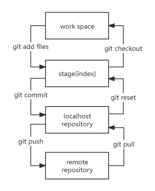
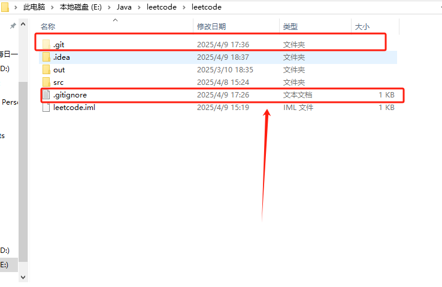

### **Git 配置**

```shell
git config -l #查看配置
git config --system --list #系统配置 对应目录 E:\git\Git\Git\etc\gitconfig
git config --global --list #用户配置 对应目录 C:\Users\Canyon\.gitconfig
```

### Git克隆

```shell
git clone + web URL
```

### git操作流程



**work space**工作区：本地项目运行的代码存放地方

**stage**暂存区：临时存放代码，一个文件，保存即将提交到文件列表信息

**localhost repository**本地代码仓库：提交之后在本地备份代码的仓库，存储所有提交版本的数据。HEAD指向最新存入仓库的版本

**remote repository**远程仓库：远程存储代码的仓库，例如github等

### 文件状态

```shell
git status #查看所有文件状态
git status [filename] #查看文件状态
git add . #将所有文件加入到暂存区
git commit -m "注释内容" #将暂存区提交到本地仓库并且添加注释内容
```

### .gitignore配置

Git 只会读取项目根目录（也就是 `.git` 所在目录）下的 `.gitignore` 文件



这样才会忽略out .idea文件的提交

```shell
git status #可以在终端输入git status查看文件的状态，被忽略的文件不会出现
```

### github公钥配置

id_rsa 私钥	id_rsa.pub 公钥

公钥上传到github的ssh配置中

```shell
ssh -T git@github.com #检测公钥是否上传
```

### idea配置github

setting里面检查本地git是否有效


setting中配置github连接 (配置ssh连接方便，免密，密钥由github生成，一般都是有时限)


```shell
git init #没有.git文件说明没有仓库，需要先初始化
git remote add origin git@github.com:GRANDCANY0N/leetcode.git #本地与远程初次建立连接
git remote set-url origin git@github.com:GRANDCANY0N/checkWeb.git #修改本地与远程的连接
##接下来idea中可以可视化操作，命令行实现
git add .
git commit -m "注释内容"
git push -u origin master #master是分支
```

### git分支

规范代码开发

```shell
#查看所有本地分支
git branch

#查看所有远程分支
git branch -r

#新建一个分支，但是停留在原始分支
git branch [branch-name]

#新建一个分支，并切换到该分支
git checkout -b [branch-name]

#合并指定分支到当前分支
$ git merge [branch] #！！！

#删除分支
$ git branch -d [branch-name]

#删除远程分支
$git push origin --delete [branch-name]
$git push -dr [remote/branch]
```

master分支一般是**稳定**的分支，代码开发时可以参照环境配置，搭建dev和pro以及test环境，最终无误后合并至master分支

### 补充

```shell
#拉取远程分支 rebese叠加提交
git pull origin master --rebase

#出现git push rejected
#远程提交被拒绝
git pull --rebase 
#在拉取远程更新时，本地存在未被 Git 跟踪的文件（untracked files），这些文件和远程分支中的文件有同名冲突
#pull不允许覆盖本地文件
```


